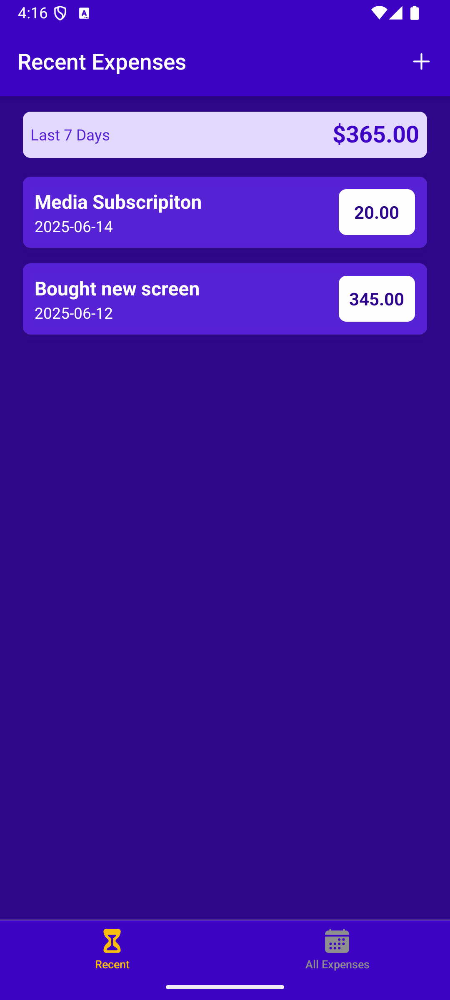
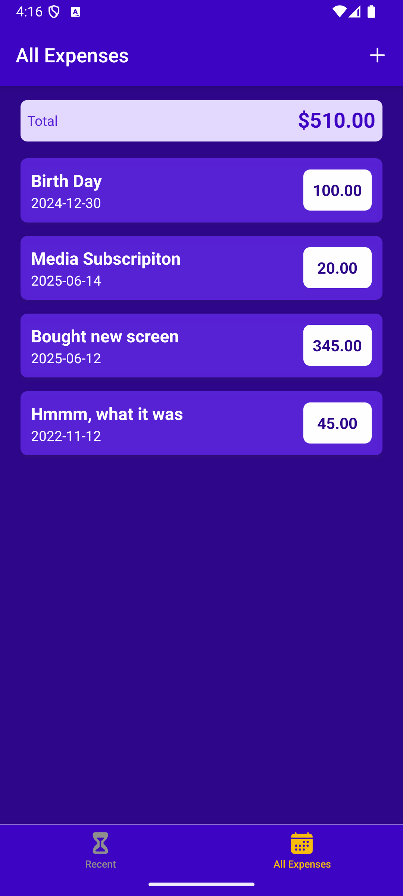
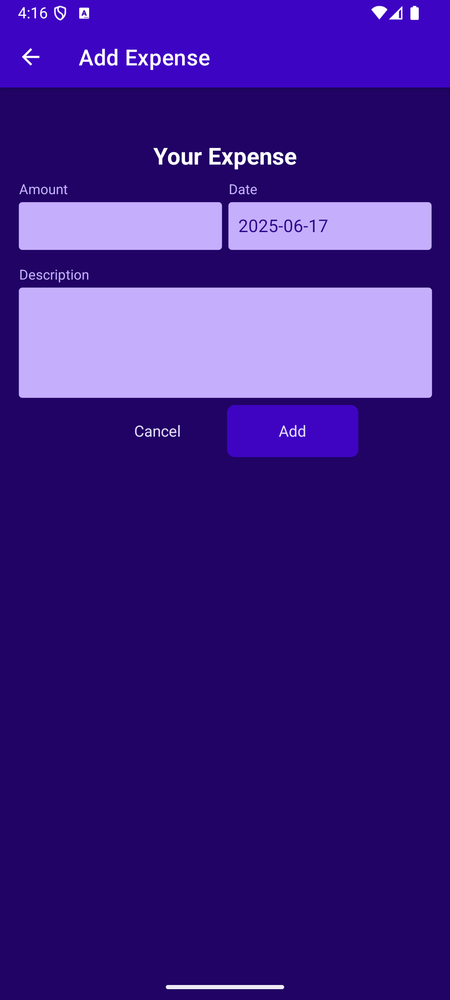
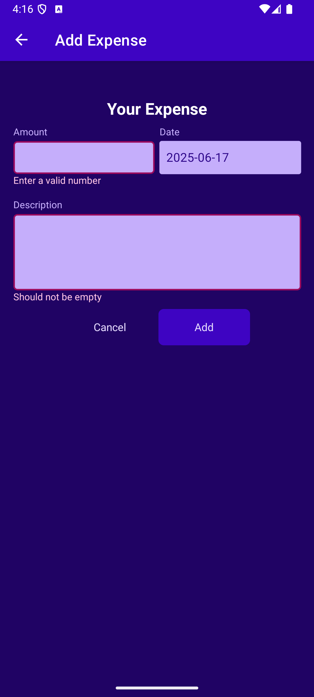
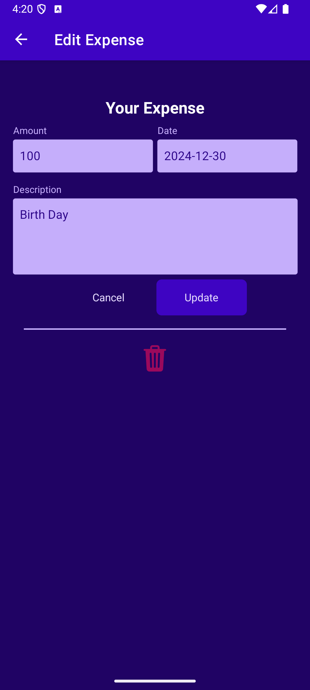
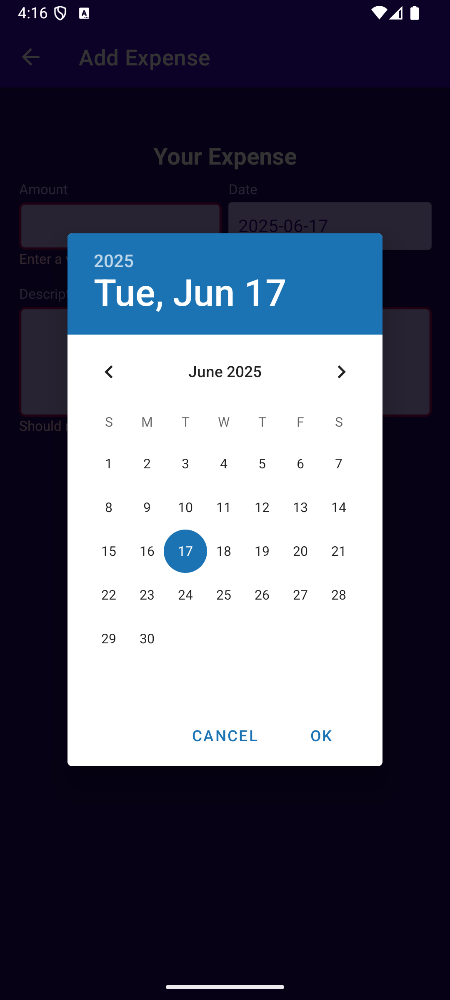
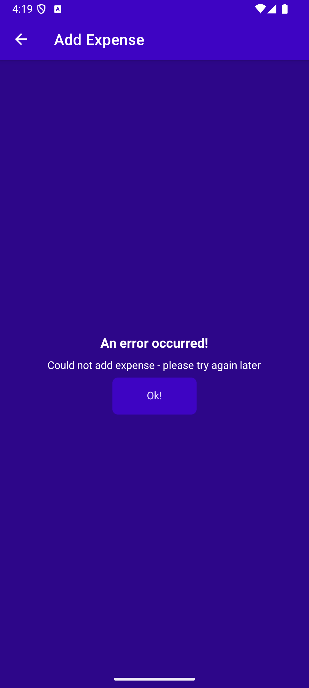
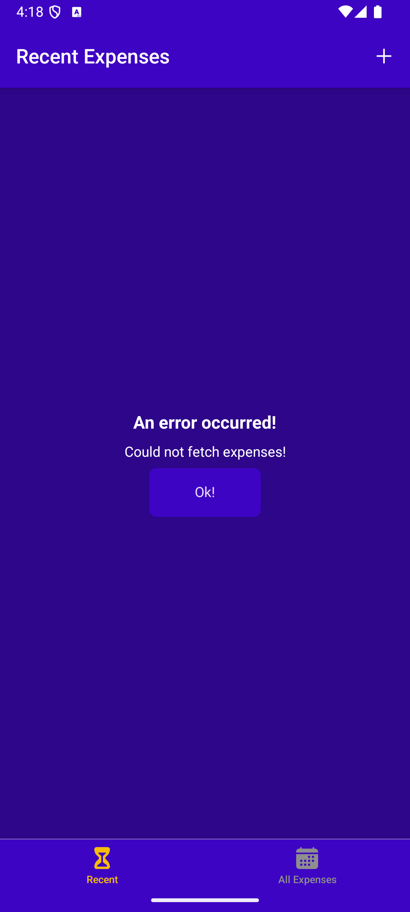

# RN Expense Tracker 📊

A simple expense tracking app built with **React Native** and **Expo**. It allows users to add expenses with description, amount, and date, and view a list of all expenses.

---

## 🧰 Technologies Used

- **React Native** — UI framework
- **Expo** — easy setup & build (`npx create-expo-app`)
- **TypeScript** — static typing
- **React Navigation** — for navigation
- **NativeWind** — Tailwind-style utility classes for styling
- **Zustand** — lightweight global state management
- **Axios** — HTTP client for API requests
- **@react-native-community/datetimepicker** — native date picking
- **Firebase** — **Firebase** — used as a backend via REST API for storing expenses

---

## 📁 Project Structure

- /components — Reusable UI components (Input, DatePicker, Button...)
- /screens — App screens
- /stores — Zustand store
- /utils — Utility functions (date formatting, etc.)
- /navigation — Navigation
- /App.tsx — Entry point

---

## 🚀 Getting Started

1. Clone the repository
```bash
git clone https://github.com/AnOvramenko/RN_Expense_Tracker.git
cd RN_Expense_Tracker
Install dependencies
```

2. Install dependencies
```bash
npm install
```

3. Start the app with Expo
```bash
npx expo start
```

4. Use a simulator or Expo Go on your device to run the app.

## ✔️ Features
- Add an expense with description, amount, and date
- Pick a date using a native DateTime picker
- Save and fetch data via HTTP requests (Axios)
- Display all expenses
- Filter expenses from the last 7 days
- Global state management with Zustand
- Error and loading states
- Responsive UI styled with NativeWind


## 📱 Screenshots

<p align="center">
  
  
  
  
  
  
  
  
</p>

---


🙌 Thank You!
Feel free to open an issue or reach out if you have feedback or suggestions!
